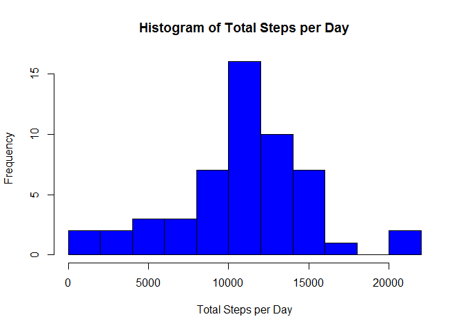
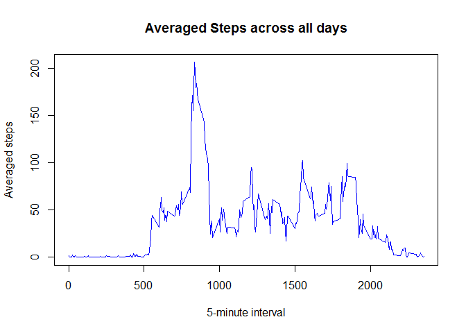
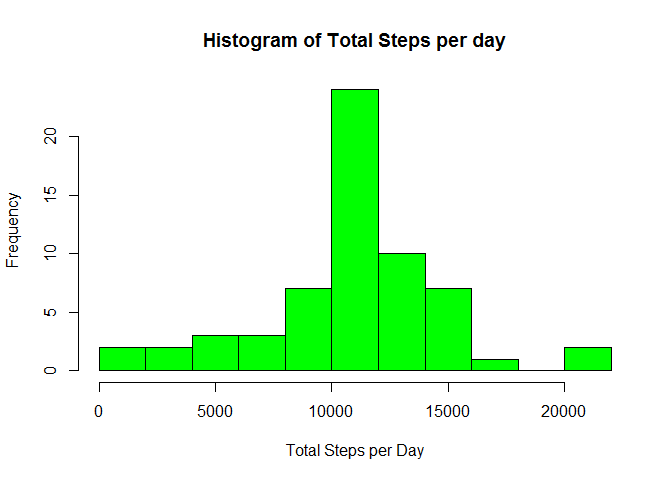
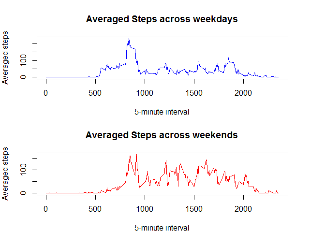

# Reproducible Research: Peer Assessment 1


## Loading and preprocessing the data

Since the dataset is compressed I will first unzip it and then, I will load it 
into a dataframe.


```r
unzip(zipfile="./activity.zip")
stepsInfo <- read.csv("./activity.csv",header=TRUE,sep=",")
```

Then, I will cast the column "date" to "Date" type and I'll aggregate the number
of steps by date


```r
stepsInfo$date <- as.Date(stepsInfo$date,"%Y-%m-%d")
totalStepsPerDay <-aggregate(steps~date,data=stepsInfo,sum,na.rm=TRUE)
```

## What is mean total number of steps taken per day?

I will make a histogram of the total number of steps taken in each day, taking 
advantage of the variable *totalStepsPerDay* calculated in the previous step


```r
hist(totalStepsPerDay$steps, breaks=15, main="Histogram of Total Steps per Day",xlab = "Total Steps per Day", col="blue")
```

<!-- -->

And now, I will calculate the mean and the median of the total number of steps taken
per day


```r
meanStepsPerDay <- mean(totalStepsPerDay$steps)
medianStepsPerDay <- median(totalStepsPerDay$steps)
```

So the **mean** is 1.0766189\times 10^{4} and the **median** is 10765.


## What is the average daily activity pattern?

I will calculate average number of steps taken (across all days) in each 5-minute 
interval, and then I will plot them


```r
averageStepsPerInterval <- aggregate(steps~interval,data=stepsInfo,mean,na.rm=TRUE)
colnames(averageStepsPerInterval)[2] <- "meanSteps"
plot(averageStepsPerInterval$meanSteps~averageStepsPerInterval$interval, type="l",main="Averaged Steps across all days",xlab="5-minute interval", ylab= "Averaged steps", col="blue")
```

<!-- -->

Now, I'll get the interval with maximum average number of steps


```r
maxIntervalStart <- averageStepsPerInterval$interval[which.max(averageStepsPerInterval$meanSteps)]
maxIntervalStop <- averageStepsPerInterval$interval[which.max(averageStepsPerInterval$meanSteps)+1]
```

So the interval with maximum average number of steps **starts at** 
minute 835 and **finishes at** minute 840

## Imputing missing values

I'll calculate first the number of entries with NA values:


```r
sum(is.na(stepsInfo$steps))
```

```
## [1] 2304
```

Then, I will replace the NA values with the average number of steps in that interval
across all days


```r
stepsInforWithoutNAs <- stepsInfo
for (i in 1:length(stepsInforWithoutNAs$steps)){
        if(is.na(stepsInforWithoutNAs$steps[i])){
                stepsInforWithoutNAs$steps[i] <- averageStepsPerInterval$meanSteps[which(averageStepsPerInterval$interval==stepsInforWithoutNAs$interval[i])]            
                }
        }
```

Finall, I will make another histogram, using this time the dataframe without NA
values, and will calculate again the mean and the median of the total number of 
steps taken per day:


```r
totalStepsPerDayWithoutNAs <-aggregate(steps~date,data=stepsInforWithoutNAs,sum)
hist(totalStepsPerDayWithoutNAs$steps, breaks=15, main="Histogram of Total Steps per day",
xlab = "Total Steps per Day", col="green")
```

<!-- -->

```r
meanStepsPerDayWithoutNAs <- mean(totalStepsPerDayWithoutNAs$steps)
medianStepsPerDayWithoutNAs <- median(totalStepsPerDayWithoutNAs$steps)
```

The **new mean** is 1.0766189\times 10^{4} and the **new median** is 1.0766189\times 10^{4}.
It can be observed the there's no great impact on the mean and median: they are
pretty much the same.


## Are there differences in activity patterns between weekdays and weekends?

I will create a new factor variable, indicating whether the days are weekdays or
weekends. This new variable will be a new column in the dataframe (named weekend)
that will hold a TRUE value for those days that are in the weekend and a FALSE 
value for those days that are not in the weekend.


```r
library(timeDate)
stepsInfoWeekends <- stepsInforWithoutNAs
stepsInfoWeekends$weekend <- as.factor(isWeekend(stepsInfoWeekends$date))
stepInfoWeekdays <- stepsInfoWeekends[stepsInfoWeekends$weekend==FALSE,]
stepInfoWeekends <- stepsInfoWeekends[stepsInfoWeekends$weekend==TRUE,]
averageStepsWeekdays <- aggregate(steps~interval,data=stepInfoWeekdays,mean)
averageStepsWeekends <- aggregate(steps~interval,data=stepInfoWeekends,mean)
colnames(averageStepsWeekdays)[2] <- "meanSteps"
colnames(averageStepsWeekends)[2] <- "meanSteps"
```

Finally, I will make two panel plots: one with the average number of steps across
weekdays and another one with the average number of steps across weekends.


```r
par(mfrow = c(2, 1), mar = c(4, 4, 4, 4))
plot(averageStepsWeekdays$meanSteps~averageStepsWeekdays$interval, 
type="l",main="Averaged Steps across weekdays",
xlab="5-minute interval", 
ylab= "Averaged steps", col="blue")
plot(averageStepsWeekends$meanSteps~averageStepsWeekends$interval, 
type="l",main="Averaged Steps across weekends",
xlab="5-minute interval", 
ylab= "Averaged steps", col="red")
```

<!-- -->

In the first panel it can be observed that in the weekdays the number of steps is 
more or less steady, except for the interval between the minute 800 (8 AM) and the
minute 930 (9:30 AM). On the other hand, the second panel shows how the activity
pattern changes notably in the weekend, where several peaks can be observed throughout the
day.

